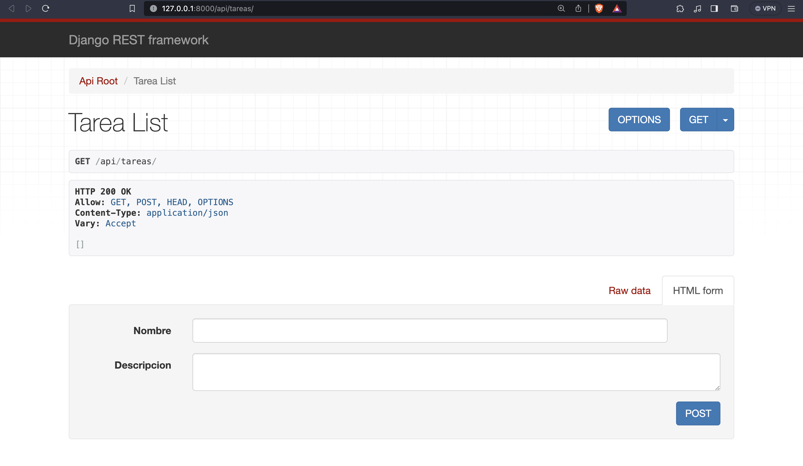
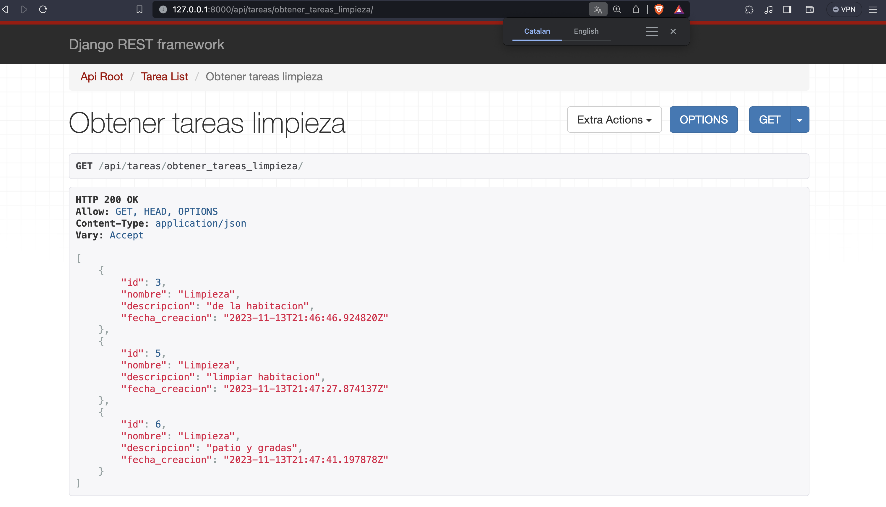
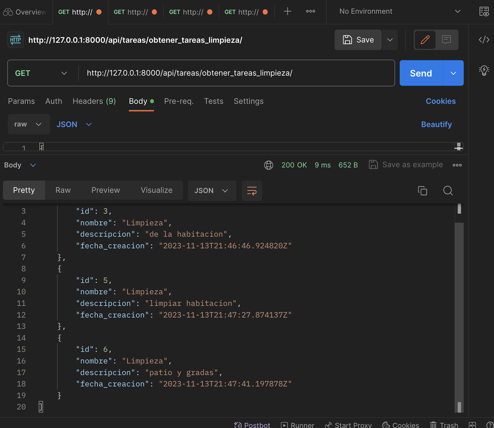
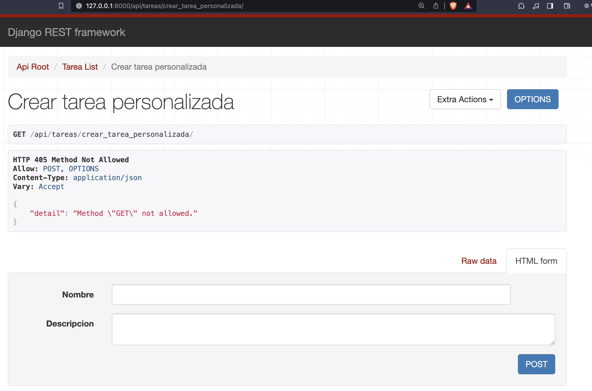
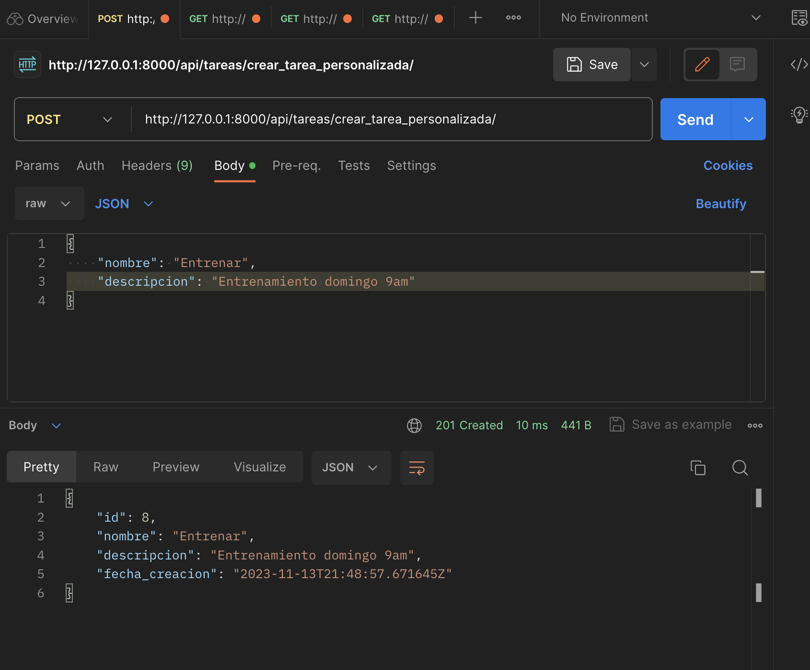

# Django Project Demo [GET, POST]

Una corta de guia de la creacion de nuestra primera app con Django con Tasks, realizando operaciones GET y POST.

## Creacion de un entorno virtual

 - [Guia Windows](https://micro.recursospython.com/recursos/como-crear-un-entorno-virtual-venv.html)

    1. Abre el CMD y ubícate en la carpeta en donde quieres crear el entorno virtual
    2. Ejecuta ```python -m venv mi_entorno```
    3. Ejecuta ```mi_entorno\Scripts\activate```
    


PD:
    Por cierto, es una buena práctica usar venv o env como los nombres del entorno virtual.
    Puedes activar el entorno virtual también haciendo ```mi_entorno\Scripts\activate.bat```, es exactamente lo mismo.
## Instalacion

Instala el framework django

```
  pip install django
```
    
Instala django-rest-framework
```
  pip install djangorestframework

```

## Empezamos con el proyecto

Creamos el proyecto de nombre `tarea_project`
```
django-admin startproject tarea_project
```

Accedemos dentro de la carpeta del proyecto ``

```
cd tarea_project
```

Creamos una aplicacion dentro del proyecto
```
python manage.py startapp tarea_app
```

Ahora dentro en la carpeta `base/settings.py`

debemos agregar lo siguiente en `INSTALLED_APPS` el nombre de nuestra aplicacion
```
INSTALLED_APPS = [
    'django.contrib.admin',
    'django.contrib.auth',
    'django.contrib.contenttypes',
    'django.contrib.sessions',
    'django.contrib.messages',
    'django.contrib.staticfiles',
    'rest_framework', # añadimos drf
    'tarea_app', #añadimos esta linea
]
```

## Definimos el modelo

En el archivo `tarea_app/models.py`

```
from django.db import models

class Tarea(models.Model):
    nombre = models.CharField(max_length=255)
    descripcion = models.TextField()
    fecha_creacion = models.DateTimeField(auto_now_add=True)

    def __str__(self):
        return self.nombre

```

Ahora realizamos las migraciones con los siguientes comando en consola

```
# Crea migraciones para tu modelo de estudiante para definir cómo se estructurará la base de datos
python manage.py makemigrations myapp

```
```
# Luego, aplica las migraciones para crear la tabla en la base de datos
python manage.py migrate
```
Ahora si observa la base de datos `db.sqlite3` ya se encuentran creadas las tablas


## Serializando
Los serializadores son unos de los componentes más poderosos que tiene Django Rest Framework. Estos permiten que estructuras complejas y modelos de nuestro proyecto en Django sean convertidos a estructuras nativas de Python y puedan ser convertidas fácilmente en JSON o XML. El uso de ellos es muy extendido y uno de los temas claves que tocaremos en este post es la optimización de serializadores.

Asi que creamos el archivo `tarea_app/serializers.py`:
```
from rest_framework import serializers
from .models import Tarea

class TareaSerializer(serializers.ModelSerializer):
    class Meta:
        model = Tarea
        fields = '__all__' # Tambien podemos especificar como ['nombre', 'descripcion'] pero __all__ incluye a todos.

```


## Vista basada en clase para la API

En el archivo `tarea_app/views.py`

```
# tarea_app/views.py
from rest_framework import viewsets
from .models import Tarea
from .serializers import TareaSerializer

class TareaViewSet(viewsets.ModelViewSet):
    queryset = Tarea.objects.all()
    serializer_class = TareaSerializer
```
Vista general del modelo Tarea serializado en DRF

## Configuración de las URL
Creamos el archivo `urls.py` dentro de `tarea_app`, configura las URL para tu vista:
```
# tarea_app/urls.py
from django.urls import path, include
from rest_framework.routers import DefaultRouter
from .views import TareaViewSet

router = DefaultRouter()
router.register(r'tareas', TareaViewSet, basename='tarea')

urlpatterns = [
    path('', include(router.urls)),
]
```

y luego en el archivo `urls.py` del proyecto:
```
# tarea_project/urls.py
from django.contrib import admin
from django.urls import path, include

urlpatterns = [
    path('admin/', admin.site.urls),
    path('api/', include('tarea_app.urls')),
]
```
## Probamos el proyecto

```
python manage.py runserver
```

Ahora, si abres tu navegador y accedes a http://127.0.0.1:8000/api/tareas/, deberías ver la lista de tareas disponibles. Este es solo el paso inicial para la operación GET. Luego, puedes expandir las vistas y serializadores para incluir operaciones CRUD completas.

Crea algunos registros de Tarea para luego visulizarlos.




Tambien ve probando con POSTMAN `https://www.postman.com/` o la extension de VSCode
## GET OPERATION
Para obtener un listado de todas las tareas con el nombre "Limpieza"...

Ahora `tarea_app/views.py` quedaria asi:

```
from django.shortcuts import render
from rest_framework.decorators import action
from rest_framework.response import Response
from rest_framework import viewsets
from .serializers import TareaSerializer
from .models import Tarea

class TareaViewSet(viewsets.ModelViewSet):
    queryset = Tarea.objects.all()
    serializer_class = TareaSerializer

    @action(detail=False, methods=['GET'])
    def obtener_tareas_limpieza(self, request):
        tareas_limpieza = Tarea.objects.filter(nombre="Limpieza")
        serializer = self.get_serializer(tareas_limpieza, many=True)
        return Response(serializer.data)
```

Para obtener el endpoint: http://127.0.0.1:8000/api/tareas/obtener_tareas_limpieza/



tambien explora el resultado con POSTMAN


## POST
Ahora añadimos la operacion POST para poder crear datos de tipo Tarea

actualizamos `tarea_app/views.py`:

```
from django.shortcuts import render
from rest_framework.decorators import action
from rest_framework.response import Response
from rest_framework import viewsets
from .serializers import TareaSerializer
from .models import Tarea

class TareaViewSet(viewsets.ModelViewSet):
    queryset = Tarea.objects.all()
    serializer_class = TareaSerializer

    @action(detail=False, methods=['GET'])
    def obtener_tareas_limpieza(self, request):
        tareas_limpieza = Tarea.objects.filter(nombre="Limpieza")
        serializer = self.get_serializer(tareas_limpieza, many=True)
        return Response(serializer.data)
    
    @action(detail=False, methods=['POST'])
    def crear_tarea_personalizada(self, request):
        # Asumiendo que los datos de la nueva tarea se envían en el cuerpo de la solicitud.
        serializer = self.get_serializer(data=request.data)
        
        if serializer.is_valid():
            serializer.save()
            return Response(serializer.data, status=201)  # 201 Created
        else:
            return Response(serializer.errors, status=400)  # 400 Bad Request
```
Ahora pasaremos los datos en el body del request para eso usamos Postman al endpoint: http://127.0.0.1:8000/api/tareas/crear_tarea_personalizada/





Recuerda usar el metodo POST


## Reto 
- Añade dos campos mas al Modelo Tarea(completado, fecha limite)
- agrega mas registros(POST operacion)
- Prueba los endpoints con Postman y con las vistas de DRF
- crea 2 endpoint de filtros